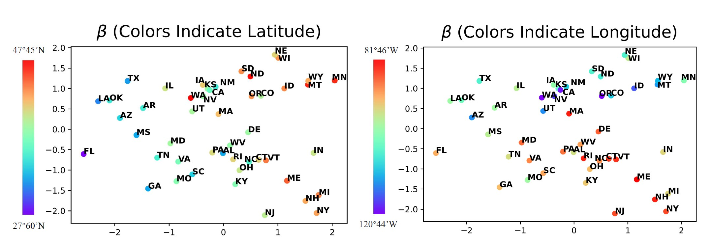
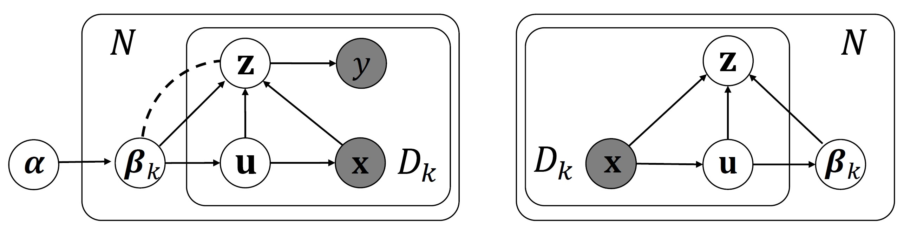
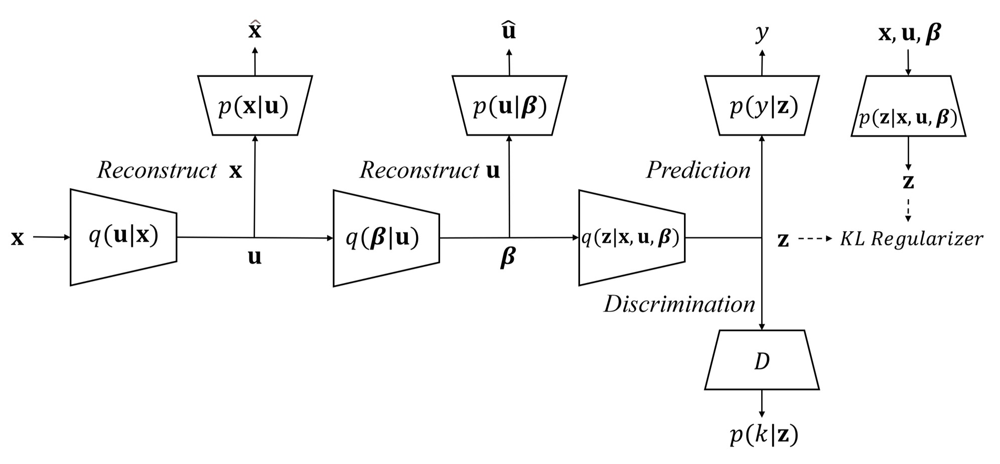
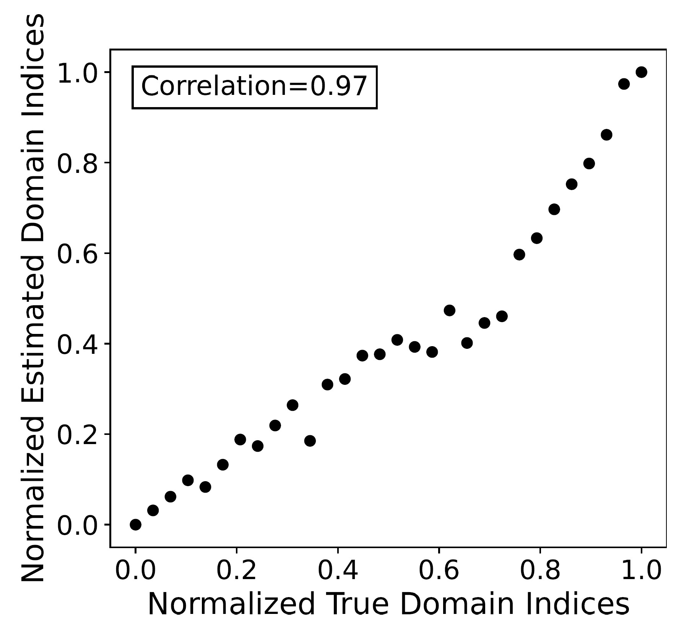
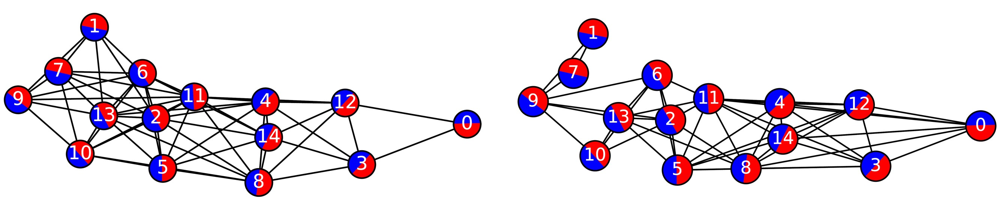
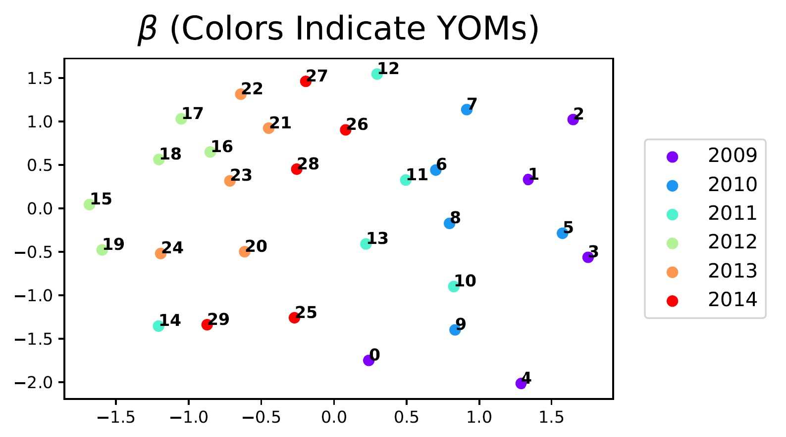

# Domain-Indexing Variational Bayes: <br>Interpretable Domain Index for Domain Adaptation (VDI)
This repo contains the code for our ICLR 2023 paper (Spotlight):<br>
**Domain-Indexing Variational Bayes: Interpretable Domain Index for Domain Adaptation**<br>
Zihao Xu*, Guang-Yuan Hao*, Hao He, Hao Wang<br>
*Eleventh International Conference on Learning Representations, 2023*<br>
[[Paper](https://arxiv.org/abs/2302.02561)][[Youtube](https://www.youtube.com/watch?v=xARD4VG19ec)][[Bilibili](https://www.bilibili.com/video/BV13N411w734/?vd_source=38c48d8008e903abbc6aa45a5cc63d8f)]

## Outline for This README
* [Brief Introduction for VDI](#brief-introduction-for-vdi)
* [Sample Visualization of Inferred Domain Indices](#sample-visualization-of-inferred-domain-indices)
* [Domain Index Definition (Informal)](#domain-index-definition-informal-see-formal-definition-in-the-paper)
* [Method Overview](#method-overview)
* [Installation](#installation)
* [Code for Different Datasets](#code-for-different-datasets)
* [Quantitative Result](#quantitative-result)
* [More Visualization of Inferred Domain Indices](#more-visualization-of-inferred-domain-indices)
* [Related Works](#also-check-our-relevant-work)
* [Reference](#reference)

## Brief Introduction for VDI
Previous studies have shown that leveraging domain index can significantly boost domain adaptation performance [[1](#paper_1),[2](#paper_2)]. However, such domain indices are not always available. VDI is the model that aims to address this challenge. To achieve this goal, we first formally define the "domain index" from the probabilistic perspective, and then **infers** domain indices from multi-domain data, with an **adversarial variational Bayesian framework**. These domain indices provide additional insight on domain relations and improve domain adaptation performance. Our theoretical analysis shows that VDI finds the optimal domain index at equilibrium.
<!-- Empirical results on both synthetic and real data verify that VDI can produce interpretable domain indices which enable us to achieve superior performance compared to state-of-the-art domain adaptation methods. -->

## Sample Visualization of Inferred Domain Indices
Below are inferred domain indices for $48$ domains in *TPT-48*. We color inferred domain indices according to ground-truth indices, latitude (**left**) and longitude (**right**). VDI's inferred indices are correlated with true indices, even though *VDI does not have access to true indices during training*.
<p align="center">

</p>
We could see that VDI's inferred domain indices are highly correlated with each domain's latitude and longitude. For example, Florida (FL) has the lowest latitude among all 48 states and is hence the left-most circle in the left figure.

## Domain Index Definition (Informal, See Formal Definition in the Paper)
We require the domain index to:
* Be independent of the data's encoding (i.e., domain-invariant encoding).
* Retain as much information on the data as possible.
* Maximize adaptation performance.

## Method Overview
We propose a Hierarchical Bayesian Deep Learning model for domain index inference, which is shown below.  **Left:** Probabilistic graphical model for VDI's generative model. **Right:** Probabilistic graphical model for the VDI's inference model. See our [paper](https://arxiv.org/abs/2302.02561) for detailed explanation.
<p align="center">

</p>

Our theortical analysis found that **maximizing our model's evidence lower bound** while **adversarially training** an additional discriminator is equivalent to **inferring the optimal domain indices** according to the [definition](#domain-index-definition-informal-see-formal-definition-in-the-paper). This gives rise to our final network structure shown below.
<p align="center">

</p>

## Installation
```python
conda create -n VDI python=3.8
conda activate VDI
conda install pytorch==1.11.0 torchvision==0.12.0 cudatoolkit=11.3 -c pytorch
pip install -r requirements.txt
```

## Code for Different Datasets
In the directory of each dataset, there are detailed steps on how to train VDI and how to visualize the inferred domain indices.
* [Experiments on Toy Datasets: Circle, DG-15 and DG-60](Toy)
* [Experiments on TPT-48](TPT-48)
* [Experiments on CompCars](CompCars)


## Quantitative Result
#### Toy Datasets: Circle, DG-15 and DG-60
<p align="center">

</p>

#### TPT-48
<p align="center">

</p>

#### CompCars
<p align="center">

</p>

## More Visualization of Inferred Domain Indices
#### Circle
Inferred domain indices (reduced to 1 dimension by PCA) with true domain indices for dataset *Circle*. VDI's inferred indices have a correlation of **0.97** with true indices.
<p align="center">

</p>

#### DG-15
**Left:** *Ground-truth* domain graph for **DG-15**. We use 'red' and 'blue' to roughly indicate positive and negative data points in a domain. **Right:** VDI's *inferred* domain graph for *DG-15*, with an AUC of **0.83**.
<p align="center">

</p>

#### CompCars
Inferred domain indices for 30 domains in *CompCars*. We color inferred domain indices according to ground-truth indices, viewpoints (**first**) and YOMs (**second**). Observations are consistent with intuition: (1) domains with the same viewpoint or YOM have similar domain indices; (2) domains with "front-side" and "rear-side" viewpoints have similar domain indices; (3) domains with "front" and "rear" viewpoints have similar domain indices.
<p align="center">
  
&nbsp; &nbsp; &nbsp; &nbsp;
  
</p>
<!-- <p align="center">

&nbsp; &nbsp; &nbsp; &nbsp;

</p>     -->


## Also Check Our Relevant Work
<span id="paper_1">[1] **Graph-Relational Domain Adaptation**<br></span>
Zihao Xu, Hao He, Guang-He Lee, Yuyang Wang, Hao Wang<br>
*Tenth International Conference on Learning Representations (ICLR), 2022*<br>
[[Paper](http://wanghao.in/paper/ICLR22_GRDA.pdf)][[Code]](https://github.com/Wang-ML-Lab/GRDA)[[Talk](https://www.youtube.com/watch?v=oNM5hZGVv34)] [[Slides](http://wanghao.in/slides/GRDA_slides.pptx)]

<span id="paper_2">[2] **Continuously Indexed Domain Adaptation**<br></span>
Hao Wang*, Hao He*, Dina Katabi<br>
*Thirty-Seventh International Conference on Machine Learning (ICML), 2020*<br>
[[Paper](http://wanghao.in/paper/ICML20_CIDA.pdf)] [[Code](https://github.com/hehaodele/CIDA)] [[Talk](https://www.youtube.com/watch?v=KtZPSCD-WhQ)] [[Blog](http://wanghao.in/CIDA-Blog/CIDA.html)] [[Slides](http://wanghao.in/slides/CIDA_slides.pptx)]

## Reference
[Domain-Indexing Variational Bayes: Interpretable Domain Index for Domain Adaptation](https://arxiv.org/abs/2302.02561)
```bib
@inproceedings{VDI,
  title={Domain-Indexing Variational Bayes: Interpretable Domain Index for Domain Adaptation},
  author={Xu, Zihao and Hao, Guang-Yuan and He, Hao and Wang, Hao},
  booktitle={International Conference on Learning Representations},
  year={2023}
}
```
