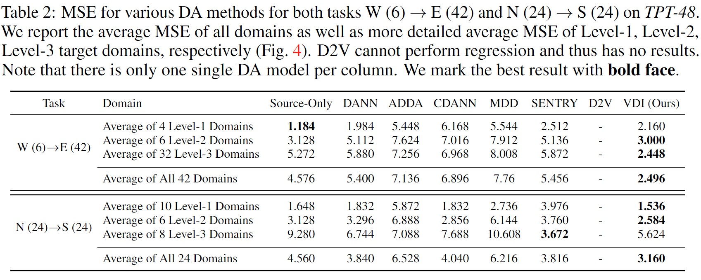
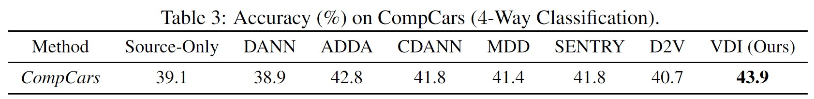

# Domain-Indexing Variational Bayes: Interpretable Domain Index for Domain Adaptation (VDI) (Updating)
This repo contains the code for our ICLR 2023 paper:<br>
**Domain-Indexing Variational Bayes: Interpretable Domain Index for Domain Adaptation**<br>
Zihao Xu*, Guang-Yuan Hao*, Hao He, Hao Wang<br>
*Eleventh International Conference on Learning Representations, 2023*<br>
[[Paper](https://arxiv.org/abs/2302.02561)]

## Brief Introduction for VDI
Previous studies have shown that leveraging domain index can significantly boost domain adaptation performance [[1](#paper_1),[2](#paper_2)]. However, such domain indices are not always available. VDI is the model that aims to address this challenge. To achieve this goal, we first formally define the "domain index" from the probabilistic perspective, and then **infers** domain indices from multi-domain data, with an **adversarial variational Bayesian framework**. These domain indice provide additional insight on domain relations and improve domain adaptation performance. Our theoretical analysis shows that VDI finds the optimal domain index at equilibrium.
<!-- Empirical results on both synthetic and real data verify that VDI can produce interpretable domain indices which enable us to achieve superior performance compared to state-of-the-art domain adaptation methods. -->

## Sample Visualization of Inferred Domain Indices

## Domain Index Definition (Informal)


## Method Overview

## More Visualization of Inferred Domain Indices

## Quantitative Result
#### Toy Dataset: Circle, DG-15 and DG-60
<p align="center">

</p>

#### TPT-48
<p align="center">

</p>

#### CompCars
<p align="center">

</p>

## Theory (Informal)

## Installation
  conda install pytorch==1.11.0 torchvision==0.12.0 torchaudio==0.11.0 cudatoolkit=11.3 -c pytorch
  pip install -r requirements.txt

## How to train VDI, and how to visualize domain indices?
In the directory of each dataset, there are detailed steps on how to train VDI and how to visualize the inferred domain indices.

## Also Check Our Relevant Work
<span id="paper_1">[1] **Graph-Relational Domain Adaptation**<br></span>
Zihao Xu, Hao He, Guang-He Lee, Yuyang Wang, Hao Wang<br>
*Tenth International Conference on Learning Representations (ICLR), 2022*<br>
[[Paper](http://wanghao.in/paper/ICLR22_GRDA.pdf)] [[Talk](https://www.youtube.com/watch?v=oNM5hZGVv34)] [[Slides](http://wanghao.in/slides/GRDA_slides.pptx)]

<span id="paper_2">[2] **Continuously Indexed Domain Adaptation**<br></span>
Hao Wang*, Hao He*, Dina Katabi<br>
*Thirty-Seventh International Conference on Machine Learning (ICML), 2020*<br>
[[Paper](http://wanghao.in/paper/ICML20_CIDA.pdf)] [[Code](https://github.com/hehaodele/CIDA)] [[Talk](https://www.youtube.com/watch?v=KtZPSCD-WhQ)] [[Blog](http://wanghao.in/CIDA-Blog/CIDA.html)] [[Slides](http://wanghao.in/slides/CIDA_slides.pptx)]

## Reference
[Domain-Indexing Variational Bayes: Interpretable Domain Index for Domain Adaptation](https://arxiv.org/abs/2302.02561)
```bib
@inproceedings{VDI,
  title={Domain-Indexing Variational Bayes: Interpretable Domain Index for Domain Adaptation},
  author={Xu, Zihao and Hao Guang-Yuan and He, Hao and Wang, Hao},
  booktitle={International Conference on Learning Representations},
  year={2023}
}
```
